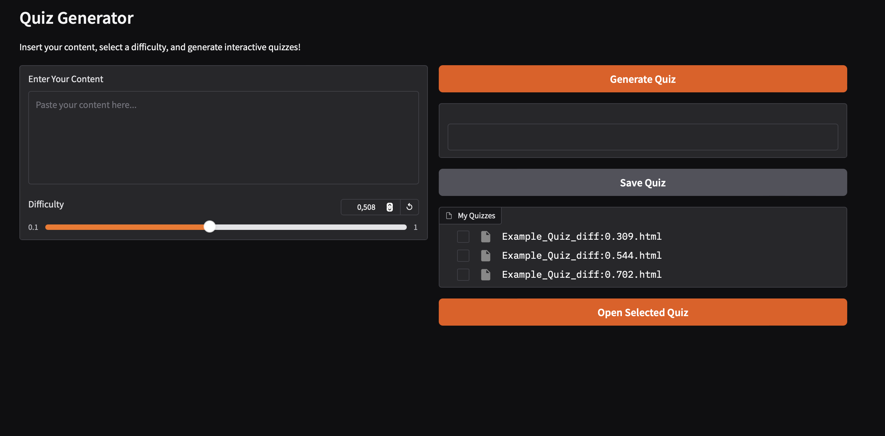
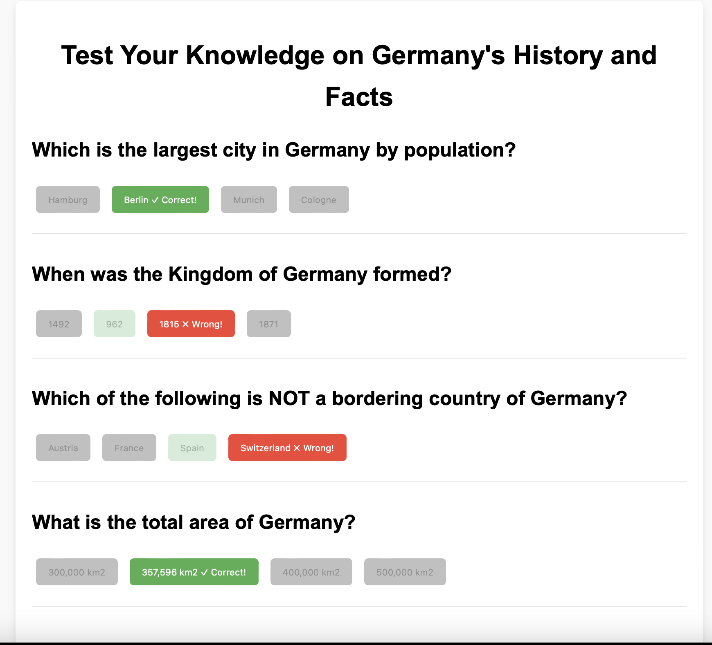

# **Quiz Generator**

## Overview
The **Quiz Generator** is a powerful and intuitive tool that transforms content into interactive HTML quizzes to test your knowledge. Leveraging the Mistral API, the app generates customized quiz questions and answers from your input text, creating a fun and engaging way to review information.

This application provides a clean and simple interface built with Gradio, making it accessible for anyone to generate, view, and save quizzes.



This is what the resulting HTML quizzes look like. Below is an example created from an article about Germany:




## Features
- **Interactive HTML Quizzes:** Generate quizzes that are fully interactive and visually appealing, designed to enhance engagement and learning.
- **Customizable Difficulty Levels:** Adjust the difficulty slider to create quizzes tailored to your level of understanding.
- **Save and Reuse Quizzes:** Easily save generated quizzes as HTML files, allowing you to revisit them later or share them with others.
- **Browser-Based Access:** Automatically opens the generated quiz in your default browser for immediate access.
- **Simple and Intuitive GUI:** The app uses Gradio for a modern and easy-to-use interface, making quiz generation a breeze.
- **Mistral API Integration:** Leverages the Mistral API to generate questions and answers based on your input content, ensuring high-quality and contextually relevant quizzes.

---

## How It Works
1. **Input Your Content:** Paste your text into the input box—this could be an article, notes, or any topic you'd like to create a quiz about.
2. **Select Difficulty:** Use the slider to set the desired difficulty level for the quiz.
3. **Generate Quiz:** Click the "Generate Quiz" button to create an HTML quiz based on your input. The app will automatically open the quiz in your browser.
4. **Save Your Quiz:** If you like the quiz, click "Save Quiz" to store it for later use.
5. **Explore Saved Quizzes:** View and open saved quizzes directly from the application.

---

## Installation

To set up the **Quiz Generator**, follow these steps:

1. **Clone the Repository:**
2. **Install Dependencies**: Use pip to install the required dependencies:
    ```bash
    pip install gradio mistralai
    ```


## Running the Application

To set up the **File Inbox Manager**, follow these steps:
1. **Before starting**

    You need to set your Mistral Api Key as environment variable.
     - On Unix/Linux/MacOS (temporary for the session):
    ```bash
    export MISTRAL_API_KEY="your-api-key"
    ```
    - On Windows (temporary for the session):
    ```bash
    set MISTRAL_API_KEY="your-api-key"
    ```
1. **Start the Program**: 
    ```bash
    python quizGen.py
    ```
2. **Access the Interface**:
    - The application uses a web-based GUI powered by Gradio.
    - Once started, you can access the app on: 
    http://127.0.0.1:7860

---

## Acknowledgments
This project utilizes the following tools and libraries:

- **[Mistral API](https://github.com/mistralai)**: Used to generate quiz questions and answers using advanced natural language processing capabilities.
- **[Gradio](https://github.com/gradio-app/gradio)**: Provides the graphical user interface for seamless interaction.
